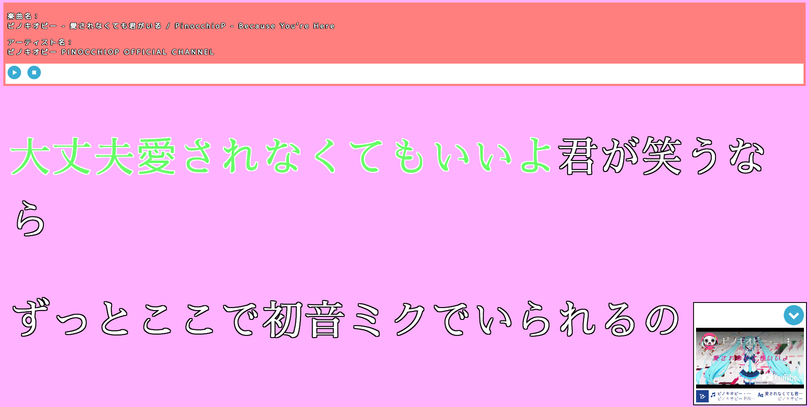
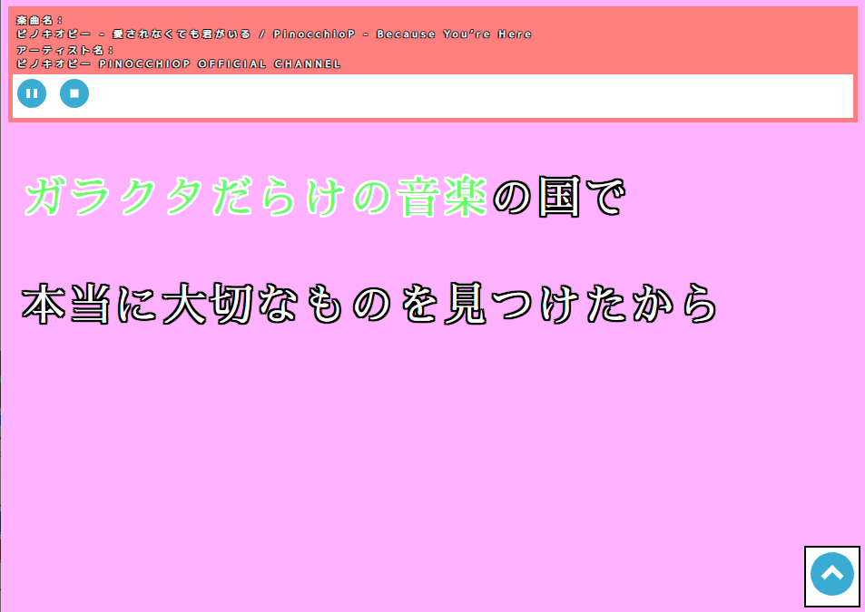

# simpleKaraoke.js
TextAlive App APIを利用したカラオケ練習ができるWebアプリケーションです。

カラオケの再生には、[TextAlive](https://textalive.jp/ "TextAlive | 歌詞アニメーションを楽しもう！ | textalive.jp")に楽曲URLと歌詞が登録されている必要があります。

# 動作確認済み環境

- [x] Bracketsのライブプレビュー機能
- [x] Google Chrome

# 使い方
再生・一時停止、停止のほか、右下に表示される動画の表示／非表示の切り替えも可能です。

`js/simpleKaraoke.js`の23～68行目、`player.createFromSongUrl(...);`のいずれか1つのコメントアウトを外すことで選曲可能です。

```JavaScript:js/simpleKaraoke.js
// グリーンライツ・セレナーデ / Omoi feat. 初音ミク
// - 初音ミク「マジカルミライ 2018」テーマソング
// - 楽曲: http://www.youtube.com/watch?v=XSLhsjepelI
// - 歌詞: https://piapro.jp/t/61Y2
/*player.createFromSongUrl("http://www.youtube.com/watch?v=XSLhsjepelI", {
  video: {
    // 音楽地図訂正履歴: https://songle.jp/songs/1249410/history
    beatId: 3818919,
    chordId: 1207328,
    repetitiveSegmentId: 1942131,
    // 歌詞タイミング訂正履歴: https://textalive.jp/lyrics/www.youtube.com%2Fwatch%3Fv%3DXSLhsjepelI
    lyricId: 50145,
    lyricDiffId: 3168
  }
});*/

// ブレス・ユア・ブレス / 和田たけあき feat. 初音ミク
// - 初音ミク「マジカルミライ 2019」テーマソング
// - 楽曲: http://www.youtube.com/watch?v=a-Nf3QUFkOU
// - 歌詞: https://piapro.jp/t/Ytwu
/*player.createFromSongUrl("http://www.youtube.com/watch?v=a-Nf3QUFkOU", {
  video: {
    // 音楽地図訂正履歴: https://songle.jp/songs/1688650/history
    beatId: 3818481,
    chordId: 1546157,
    repetitiveSegmentId: 1942135,
    // 歌詞タイミング訂正履歴: https://textalive.jp/lyrics/www.youtube.com%2Fwatch%3Fv=a-Nf3QUFkOU
    lyricId: 50146,
    lyricDiffId: 3143
  }
});*/

// 愛されなくても君がいる / ピノキオピー feat. 初音ミク
// - 初音ミク「マジカルミライ 2020」テーマソング
// - 楽曲: http://www.youtube.com/watch?v=ygY2qObZv24
// - 歌詞: https://piapro.jp/t/PLR7
player.createFromSongUrl("http://www.youtube.com/watch?v=ygY2qObZv24", {
  video: {
    // 音楽地図訂正履歴: https://songle.jp/songs/1977449/history
    beatId: 3818852,
    chordId: 1955797,
    repetitiveSegmentId: 1942043,
    // 歌詞タイミング訂正履歴: https://textalive.jp/lyrics/www.youtube.com%2Fwatch%3Fv=ygY2qObZv24
    lyricId: 50150,
    lyricDiffId: 3158
  }
});
```

# プレビュー




